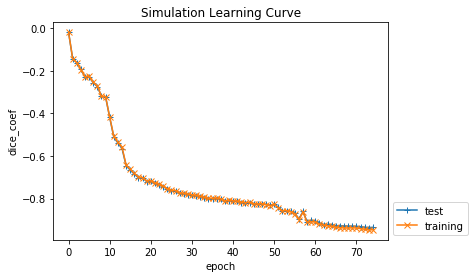
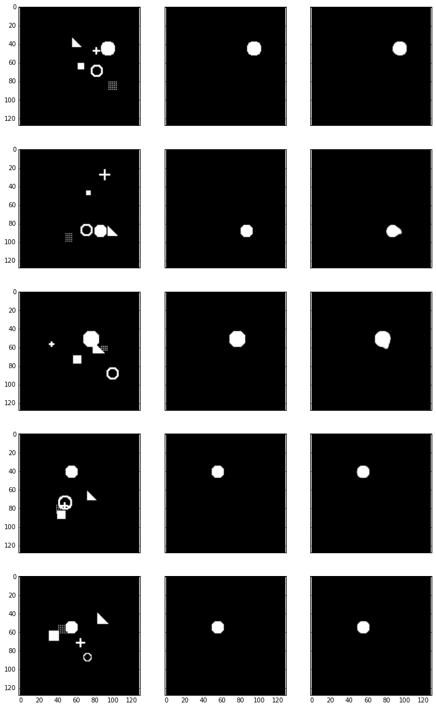

```python
import numpy as np
import cntk_unet
import simulation
%matplotlib inline
import helper

import cntk as C
from cntk.learners import learning_rate_schedule, UnitType
```


```python
# Generate some random images
input_images, target_masks = simulation.generate_random_data(192, 192, count=3)

print(input_images.shape, target_masks.shape)

# Change channel-order and make 3 channels for matplot
input_images_rgb = [(x.swapaxes(0, 2).swapaxes(0,1).repeat(3, axis=2) * -255 + 255).astype(np.uint8) for x in input_images]

# Map each channel (i.e. class) to each color
target_masks_rgb = [helper.masks_to_colorimg(x) for x in target_masks]

# Left: Input image, Right: Target mask
helper.plot_side_by_side([input_images_rgb, target_masks_rgb])
```

    (3, 1, 192, 192) (3, 6, 192, 192)


```python
from cntk.device import try_set_default_device, gpu
try_set_default_device(gpu(0))

def slice_minibatch(data_x, data_y, i, minibatch_size):
    sx = data_x[i * minibatch_size:(i + 1) * minibatch_size]
    sy = data_y[i * minibatch_size:(i + 1) * minibatch_size]
    
    return sx, sy

def measure_error(data_x, data_y, x, y, trainer, minibatch_size):
    errors = []
    for i in range(0, int(len(data_x) / minibatch_size)):
        data_sx, data_sy = slice_minibatch(data_x, data_y, i, minibatch_size)        

        errors.append(trainer.test_minibatch({x: data_sx, y: data_sy}))

    return np.mean(errors)

def train(images, masks, use_existing=False):  
    shape = input_images[0].shape
    data_size = input_images.shape[0]
    
    # Split data
    test_portion = int(data_size * 0.1)
    indices = np.random.permutation(data_size)
    test_indices = indices[:test_portion]
    training_indices = indices[test_portion:]

    test_data = (images[test_indices], masks[test_indices])
    training_data = (images[training_indices], masks[training_indices])

    # Create model
    x = C.input_variable(shape)
    y = C.input_variable(masks[0].shape)

    z = cntk_unet.create_model(x, masks.shape[1])
    dice_coef = cntk_unet.dice_coefficient(z, y)

    # Load the saved model if specified
    checkpoint_file = "cntk-unet.dnn"
    if use_existing:
        z.load_model(checkpoint_file)

    # Prepare model and trainer
    lr = learning_rate_schedule(0.00001, UnitType.sample)
    momentum = C.learners.momentum_as_time_constant_schedule(0.9)
    trainer = C.Trainer(z, (-dice_coef, -dice_coef), C.learners.adam(z.parameters, lr=lr, momentum=momentum))

    # Get minibatches of training data and perform model training
    minibatch_size = 8
    num_epochs = 75
    
    training_errors = []
    test_errors = []

    for e in range(0, num_epochs):
        for i in range(0, int(len(training_data[0]) / minibatch_size)):
            data_x, data_y = slice_minibatch(training_data[0], training_data[1], i, minibatch_size)

            trainer.train_minibatch({x: data_x, y: data_y})
        
        # Measure training error
        training_error = measure_error(training_data[0], training_data[1], x, y, trainer, minibatch_size)
        training_errors.append(training_error)
        
        # Measure test error
        test_error = measure_error(test_data[0], test_data[1], x, y, trainer, minibatch_size)
        test_errors.append(test_error)

        print("epoch #{}: training_error={}, test_error={}".format(e, training_errors[-1], test_errors[-1]))
        
        trainer.save_checkpoint(checkpoint_file)

    return trainer, training_errors, test_errors
```


```python
input_images, target_masks = input_images, target_masks = simulation.generate_random_data(192, 192, count=1024)

trainer, training_errors, test_errors = train(input_images, target_masks)
```

    epoch #0: training_error=-0.019768690868564275, test_error=-0.020717654066781204
    epoch #1: training_error=-0.14359762888887653, test_error=-0.14444618796308836
    epoch #2: training_error=-0.16253145324147267, test_error=-0.16211109856764475
    epoch #3: training_error=-0.19506786180579144, test_error=-0.19313516840338707
    epoch #4: training_error=-0.22743441371814063, test_error=-0.2299772041539351
    epoch #5: training_error=-0.22651763014171433, test_error=-0.2276181268195311
    epoch #6: training_error=-0.25330155660276826, test_error=-0.2570686799784501
    epoch #7: training_error=-0.27093734209952147, test_error=-0.2745807444055875
    epoch #8: training_error=-0.32097409859947534, test_error=-0.3199269076188405
    epoch #9: training_error=-0.32212045840595077, test_error=-0.3231043294072151
    epoch #10: training_error=-0.4180802334909854, test_error=-0.41908330221970874
    epoch #11: training_error=-0.5081395947414896, test_error=-0.5119023198882738
    epoch #12: training_error=-0.5355584644753, test_error=-0.5396901319424311
    epoch #13: training_error=-0.5596165833265885, test_error=-0.5651968071858088
    epoch #14: training_error=-0.6433821154677349, test_error=-0.6459879775842031
    epoch #15: training_error=-0.6609660775765128, test_error=-0.6660722494125366
    epoch #16: training_error=-0.6821304870688397, test_error=-0.6858411679665247
    epoch #17: training_error=-0.6975538927575816, test_error=-0.7021944771210352
    epoch #18: training_error=-0.7028526124746903, test_error=-0.7015786518653234
    epoch #19: training_error=-0.7167597547821377, test_error=-0.720397874712944
    epoch #20: training_error=-0.7156574731287749, test_error=-0.7193131099144617
    epoch #21: training_error=-0.7252500445946403, test_error=-0.7287015269200007
    epoch #22: training_error=-0.7334559886351876, test_error=-0.7369491656621298
    epoch #23: training_error=-0.7400820079057113, test_error=-0.74381023645401
    epoch #24: training_error=-0.7529412295507348, test_error=-0.7539715717236201
    epoch #25: training_error=-0.7605505870736163, test_error=-0.7639513413111368
    epoch #26: training_error=-0.7628906576529794, test_error=-0.7664126455783844
    epoch #27: training_error=-0.7715898026590762, test_error=-0.7751793265342712
    epoch #28: training_error=-0.7752938420876213, test_error=-0.7786444971958796
    epoch #29: training_error=-0.7786822977273361, test_error=-0.7816734810670217
    epoch #30: training_error=-0.782146718191064, test_error=-0.7854048907756805
    epoch #31: training_error=-0.7842959367710611, test_error=-0.7869394868612289
    epoch #32: training_error=-0.7898872852325439, test_error=-0.7923590739568075
    epoch #33: training_error=-0.7931342622508173, test_error=-0.7958166400591532
    epoch #34: training_error=-0.7994443261105081, test_error=-0.8019372572501501
    epoch #35: training_error=-0.7979994908623074, test_error=-0.8004395614067713
    epoch #36: training_error=-0.7975412876709648, test_error=-0.8000765045483907
    epoch #37: training_error=-0.8006633597871532, test_error=-0.8025749226411184
    epoch #38: training_error=-0.8104041752607926, test_error=-0.812293271223704
    epoch #39: training_error=-0.8078771876252215, test_error=-0.8101015339295069
    epoch #40: training_error=-0.8104296383650407, test_error=-0.8116654952367147
    epoch #41: training_error=-0.812252676486969, test_error=-0.8135889967282613
    epoch #42: training_error=-0.8167183248893074, test_error=-0.8186343262592951
    epoch #43: training_error=-0.8183319314666416, test_error=-0.8183851490418116
    epoch #44: training_error=-0.8180797893068065, test_error=-0.8185829023520151
    epoch #45: training_error=-0.8236719385437343, test_error=-0.8233668257792791
    epoch #46: training_error=-0.8258916523145593, test_error=-0.8249997198581696
    epoch #47: training_error=-0.8239949169366256, test_error=-0.8246004184087118
    epoch #48: training_error=-0.8278672368630119, test_error=-0.8268091479937235
    epoch #49: training_error=-0.832696767475294, test_error=-0.831729864080747
    epoch #50: training_error=-0.8263022370960401, test_error=-0.8262786467870077
    epoch #51: training_error=-0.842771373624387, test_error=-0.8406341224908829
    epoch #52: training_error=-0.857192787916764, test_error=-0.8564214507738749
    epoch #53: training_error=-0.8568549975104954, test_error=-0.8593804885943731
    epoch #54: training_error=-0.86151617091635, test_error=-0.8591275463501612
    epoch #55: training_error=-0.8698923546334971, test_error=-0.8672014276186625
    epoch #56: training_error=-0.899405440558558, test_error=-0.8971130202213923
    epoch #57: training_error=-0.8627254413521808, test_error=-0.8596462905406952
    epoch #58: training_error=-0.9112692019213801, test_error=-0.9090506235758463
    epoch #59: training_error=-0.9077493258144544, test_error=-0.9010724077622095
    epoch #60: training_error=-0.9106351442958998, test_error=-0.9055953522523245
    epoch #61: training_error=-0.9199885093647501, test_error=-0.913592591881752
    epoch #62: training_error=-0.924489686800086, test_error=-0.9214814503987631
    epoch #63: training_error=-0.9274574082830678, test_error=-0.9210271586974462
    epoch #64: training_error=-0.9304829752963523, test_error=-0.9223643392324448
    epoch #65: training_error=-0.9349522372950678, test_error=-0.9265173921982447
    epoch #66: training_error=-0.9366193714349166, test_error=-0.9279018491506577
    epoch #67: training_error=-0.9376024194385695, test_error=-0.9277462114890417
    epoch #68: training_error=-0.9381804207096929, test_error=-0.928676704565684
    epoch #69: training_error=-0.9367524255876956, test_error=-0.9292152722676595
    epoch #70: training_error=-0.9380349750104158, test_error=-0.9298784782489141
    epoch #71: training_error=-0.9406253742135089, test_error=-0.9317039549350739
    epoch #72: training_error=-0.944081843935925, test_error=-0.9340653717517853
    epoch #73: training_error=-0.9468802089276521, test_error=-0.9356546898682913
    epoch #74: training_error=-0.9458474998888762, test_error=-0.9347378015518188


```python
helper.plot_errors({"training": training_errors, "test": test_errors}, title="Simulation Learning Curve")
```





```python
# Generate some random images
input_images, target_masks = input_images, target_masks = simulation.generate_random_data(192, 192, count=10)

# Predict
pred = trainer.model.eval(input_images)

print(input_images.shape, target_masks.shape, pred.shape)
```

    (10, 1, 192, 192) (10, 6, 192, 192) (10, 6, 192, 192)


```python
# Change channel-order and make 3 channels for matplot
input_images_rgb = [(x.swapaxes(0, 2).swapaxes(0,1).repeat(3, axis=2) * -255 + 255).astype(np.uint8) for x in input_images]

# Map each channel (i.e. class) to each color
target_masks_rgb = [helper.masks_to_colorimg(x) for x in target_masks]
pred_rgb = [helper.masks_to_colorimg(x) for x in pred]

# Left: Input image, Middle: Correct mask (Ground-truth), Rigth: Predicted mask
helper.plot_side_by_side([input_images_rgb, target_masks_rgb, pred_rgb])
```




